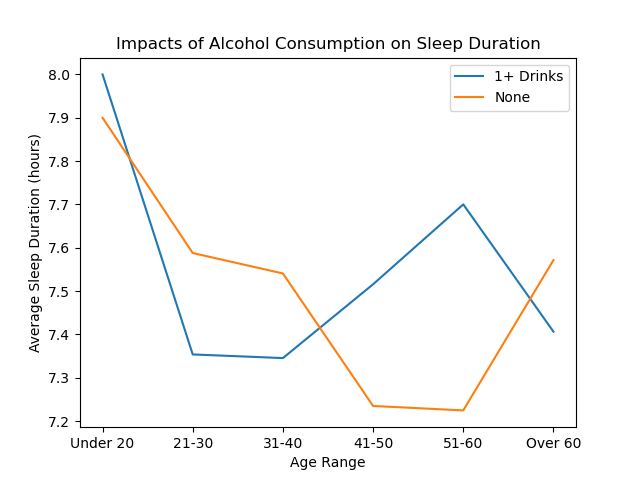
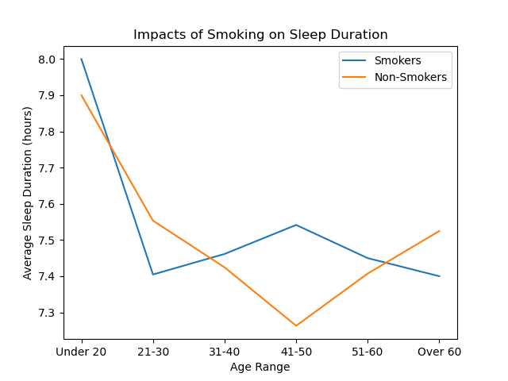

# Factors Affecting Sleep

*Sleep is an essential bodily function to maintain optimal physical and mental health. A good night's rest allows the body to reset, rest, and has been proven to have extreme benefits, however there are several factors that can affect how efficient and how long a person sleeps per night. As technology has advanced, it has become easier to track not only time sleeping, but sleep quality on a regular basis using devices such as health trackers and smart watches.
 In our study, we attempt to find correlations between several external factors that may affect sleep duration and sleep efficiency in adults.*

 *  The dataset used for this analysis was downloaded from Kaggle. It was collected as part of a study conducted in the UK by a research team from The University of Oxfordshire

 *  Overview of Population:
    - Overall population count - 388 
    - % Male - 50.0
    - % Female - 50.0
    - Age Range - 9 to 69
    - % Smokers - 34.3
    - Average Sleep Duration - 7.45 hours

*   Deep and Light Sleep v/s Sleep Efficiency
    -   From the high degree of correlation between sleep efficiency and deep sleep percentage, it is safe to assume that the sleep efficiency score is derived from the deep sleep percentage

*   Factors affecting Sleep
    -   Age
        - There was no correlation found between sleep efficiency and age. The r-value is 0.12 which points to almost non-existent correlation.

            
    -   Gender
        - 41-50 age group has lowest sleep duration but highest efficiency for females
        - After age 50, women have higher sleep duration but lower sleep efficiency
        
        
    -   Alcohol Consumption:
        - Alcohol consumption and sleep efficiency
            - The data suggest that the effect of alcohol on sleep efficiency varies with different age groups. 
            - For ages 20 – 25: the more drinks you consume, your sleep efficiency improves greatly.
            - After 25 years, the sleep efficiency improves but a slower rate. 
            - And After 45 years sleep efficiency drops drastically with each additional drink consumed.
            
        - Alcohol consumption and sleep duration
            - The more alcohol consumed the less hours of sleep an individual aged 20 to 25. 
            - The inverse is true for people 25 to 55 years. They get more hours of sleep with more alcohol consumed. 
            - This trend reverses once people reach 55 and above. 
            
    -   Smoking:
        - Smoking and sleep efficiency
            - Smokers between 20 to 25 experiences fall in sleep efficiency the more increase in smoking. 
            - Meanwhile smokers between 25 to 45 do see improvement in sleep efficiency when they increase their smoking rate. 
            
        - Smoking and sleep duration
            - Similarly, Ages 20 to 25 experience less sleep duration when they increase smoke more.
            - Conversely, 25 to 45 years of age do experience a slight increase in sleep duration. 
            - But After 45 years that trend reverses back to decrease in sleep duration with increase smoking.
            
    - Exercise:
        - Exercise and sleep efficiency
            - For young adults (20yrs to 25yrs) with more exercise they experience sharp improvement in sleep efficiency.
            - The sleep efficiency improvements because of exercise slow down after 25yrs.
            - After 45 years, you start experiencing negative effect on sleep efficiency with more exercise.
            
        - Exercise and sleep duration
            - According to the data, more exercise does indicate a sharp reduction in sleep duration for young adults (20 to 25 yrs.)
            - This trend reverses with adults 35yrs and above.
            - At 55yrs and above, there is a sharp improvement in sleep duration with increase in exercise. 
            

*   Possible Bias

